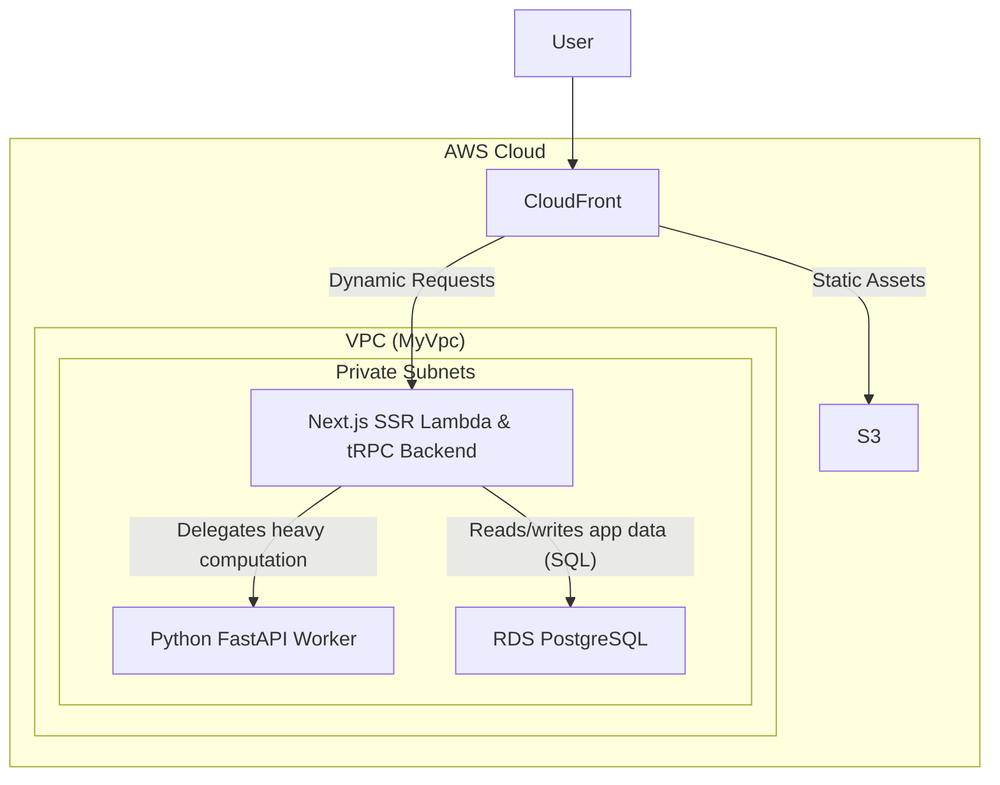

# System Architecture

This document outlines the architecture of the BatchProt application, which is deployed on AWS using the [SST framework](https://sst.dev/).

## Overview

The application is a modern web application with a decoupled frontend and backend. The infrastructure is defined as code using TypeScript and SST constructs. The main components are:

-   A **Next.js web application** for the user interface.
-   A **Python FastAPI backend** for core business logic.
-   A **PostgreSQL database** for data persistence.
-   All components are hosted within a secure **Virtual Private Cloud (VPC)** on AWS.

Below is a diagram illustrating the high-level architecture:

## Components

### 1. Frontend (`MyWeb`)

-   **Framework**: Next.js, providing Server-Side Rendering (SSR), Static Site Generation (SSG), and API routes.
-   **Infrastructure**: Deployed using SST's `NextjsSite` construct, which provisions a serverless architecture optimized for Next.js.
-   **Hosting**:
    -   **Amazon CloudFront**: Acts as the global Content Delivery Network (CDN). It caches static content at edge locations for low latency and serves dynamic content by routing requests to the SSR Lambda.
    -   **Amazon S3**: Stores all static assets like JavaScript, CSS, images, and other public files.
    -   **AWS Lambda**:
        -   An SSR function runs the Next.js server to render pages dynamically.
        -   An Image Optimization function is automatically created to handle `next/image`.
        -   The application's tRPC backend runs within this Lambda environment, acting as a "Backend for Frontend" (BFF). It handles all business logic, including authentication and database interactions.
    -   **Amazon SQS & DynamoDB**: These are used internally by the `NextjsSite` construct to handle Incremental Static Regeneration (ISR) and revalidation.

### 2. Backend API (`BatchProtAPI`)

-   **Framework**: Python with FastAPI, providing a robust and fast API for core, stateless business logic (e.g., protein analysis).
-   **Infrastructure**: Deployed as an **AWS Lambda function**. Crucially, it's packaged as a **Docker container image** instead of a standard zip file. This approach is necessary to include large dependencies (like `numpy` or `pandas` for protein analysis) that would otherwise exceed the standard AWS Lambda deployment size limits. It acts as a stateless compute worker.
-   **Networking**:
    -   It resides in the **private subnets** of the VPC, ensuring it is not directly accessible from the public internet.
-   **Data Access**: This service is stateless and does **not** have direct access to the database. It receives data from the Next.js backend, performs computations, and returns the result.
-   **Exposure**: The API is exposed via an **AWS Lambda Function URL**. The Next.js tRPC backend is its only consumer.

### 3. Database (`MyPostgres`)

-   **Engine**: PostgreSQL, managed by **Amazon RDS**.
-   **Infrastructure**: Deployed using SST's `RDS` construct. It is configured as a serverless cluster that can scale automatically based on load.
-   **Networking**: Located in the **private subnets** of the VPC for maximum security. It only accepts connections from resources within the VPC, specifically the **Next.js tRPC backend**.
-   **Migrations**: Database schema changes are managed through migration files located in `packages/database/migrations`.

### 4. Networking (`MyVpc`)

-   **Infrastructure**: A custom **Amazon Virtual Private Cloud (VPC)** created by SST.
-   **Structure**:
    -   **Public Subnets**: Contain resources that need to be accessible from the internet, like NAT Gateways. The CloudFront distribution is public, but it's a global service that routes to resources inside the VPC.
    -   **Private Subnets**: Host the core application logic and data layers (Next.js SSR Lambda, FastAPI Lambda, RDS instance) to protect them from direct public access.
    -   **NAT Gateways**: Allow resources in the private subnets to make outbound requests to the internet (e.g., for calling external APIs) without being directly reachable from the internet.

## Communication & Data Flow

1.  A user interacts with the application, triggering an event in the browser.
2.  The Next.js client-side application makes a call to a **tRPC procedure** in the Next.js backend.
3.  The request hits **CloudFront**, which routes the API request to the **Next.js SSR Lambda**.
4.  The **tRPC procedure** in the Next.js backend executes.
    -   If the task involves heavy computation (like protein analysis), the tRPC procedure makes an HTTP request to the **`BatchProtAPI` (FastAPI Worker)**, passing the necessary data. The FastAPI service processes the data and returns the result to the tRPC procedure.
    -   The tRPC procedure then handles all interactions with the **`MyPostgres` RDS database**, such as persisting job results, updating user data, or handling authentication logic.
5.  The final result is sent back through the tRPC client to the user's browser. 
